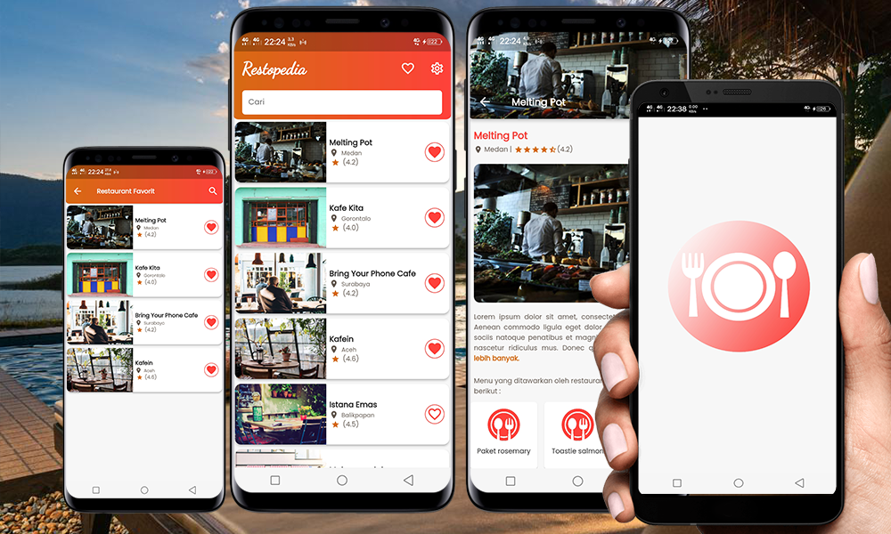

# Restopedia 

    

 

## Features

- search restaurant,
- favorite restaurant,
- restaurant details,
- user reviews,
- scheduled notifications

## Dependencies

- provider: ^6.0.3
- flutter_local_notifications: ^12.0.2
- android_alarm_manager_plus: ^2.1.0
- sqflite: ^2.1.0
- and others

## Demo APK

